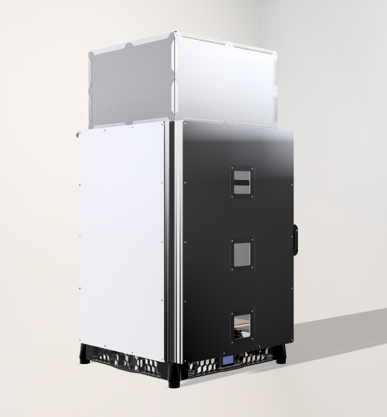

# EZDOOMBAKE - WIP
EZDOOMBAKE - A modified Voron V2.4 350mm with 800mm tall 4040 verticals and 2040 horizontals, insulated, hinged, easily removeable panels and doors, top hat. Built to house Stealthchanger with MonolithAWD. Inspired by Voron, FrankenVoron and DraftShiftDesign

